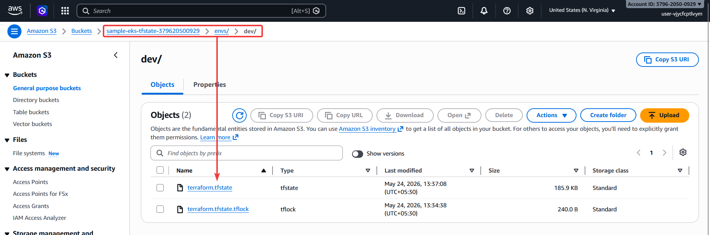
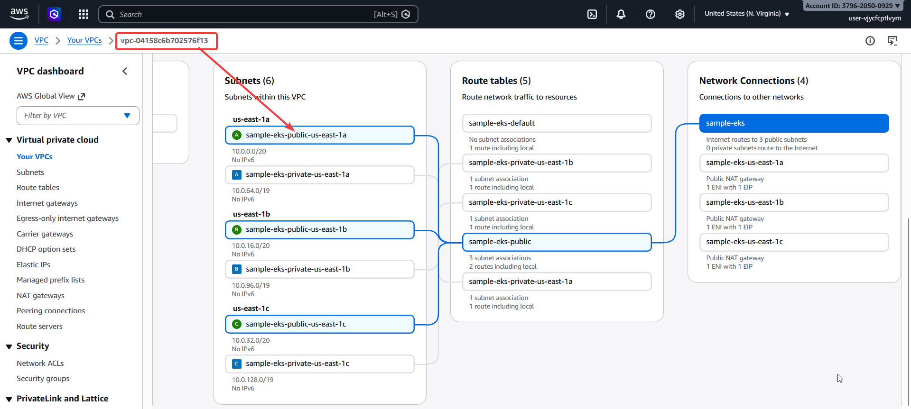
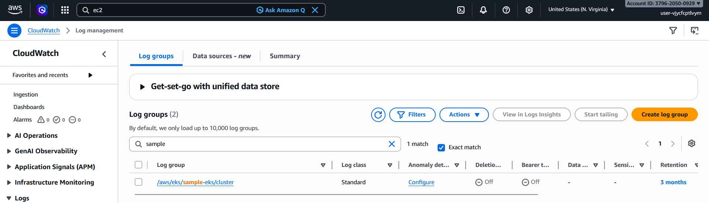
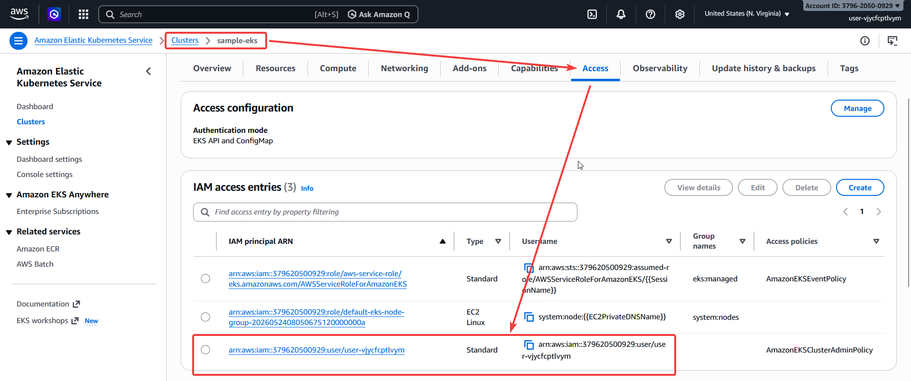
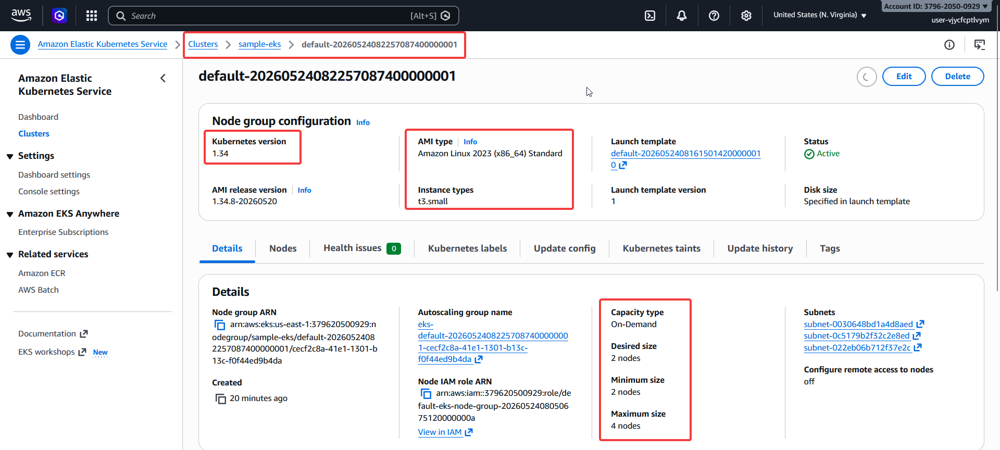
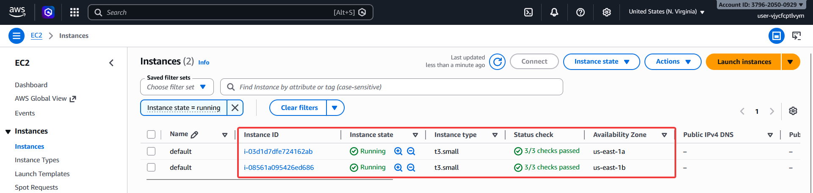
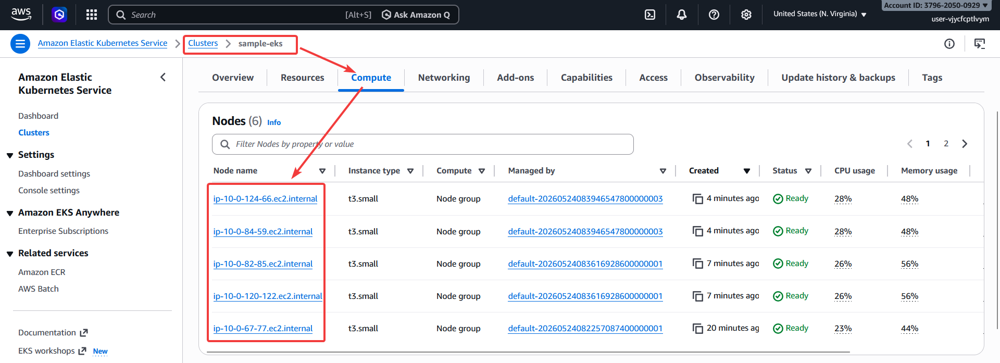
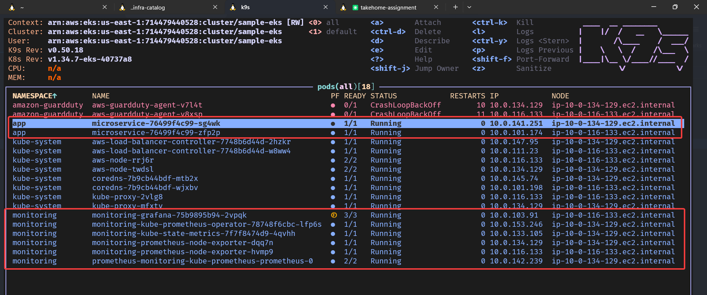
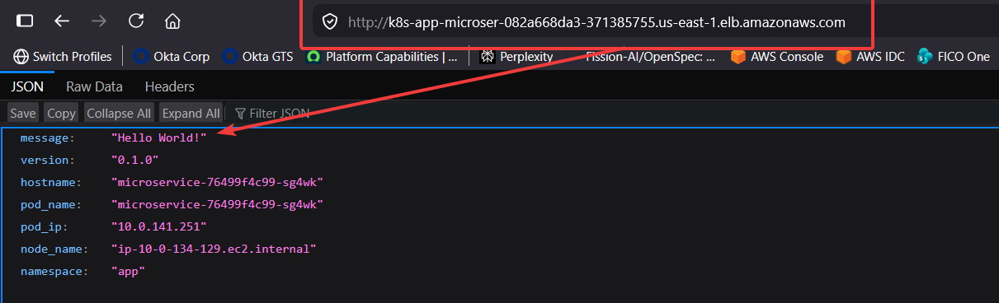
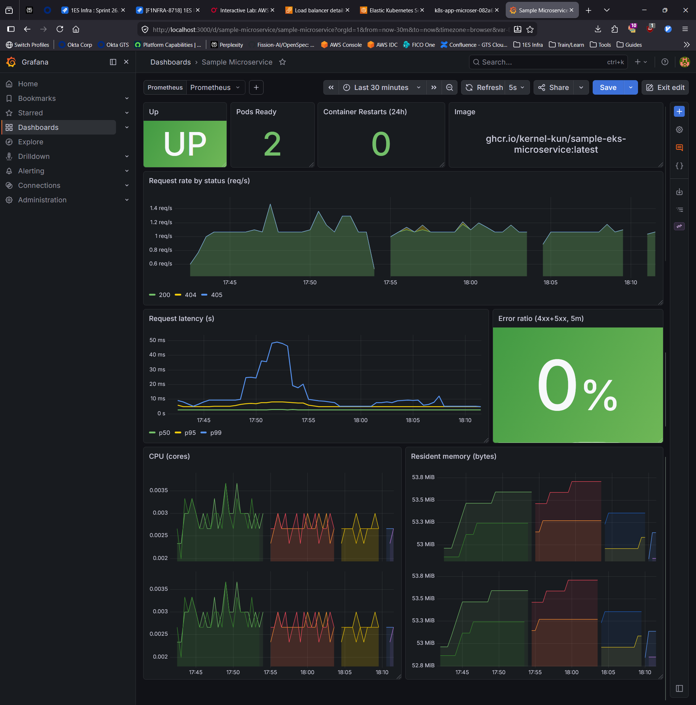

# sample-eks-microservice

A small FastAPI service running on Amazon EKS, with the network, cluster, and
deploy pipeline that gets it there. The whole thing comes up from a clean AWS
account in roughly twenty minutes and tears down in ten.

## Quickstart

There are two end-to-end paths from a clean AWS account to a live URL. Pick one.

### Option A — one click in GitHub Actions (recommended)

The `deploy` workflow can provision **and** install everything in a single run.

> Actions → **deploy** → **Run workflow** → leave `action=apply`, paste AWS
> credentials, click **Run workflow**.

The job creates the S3 state bucket if it doesn't exist, runs
`terraform apply`, installs the three Helm releases in order, polls for the
ALB hostname, smoke-tests `/healthz`, and prints the public URL in the run
summary. To tear everything down, run the same workflow again with
`action=destroy`.

### Option B — local end-to-end

```bash
# 0. Prereqs: aws CLI v2 (authenticated), terraform >= 1.10, kubectl, helm 3.x,
#    docker (with buildx) for local image builds. Python 3.12+ for local app dev.

# 1. Create the S3 bucket for Terraform state. S3 names are global, so embed
#    the account id to keep re-runs from colliding.
export TFSTATE_BUCKET=sample-eks-tfstate-$(aws sts get-caller-identity --query Account --output text)
export AWS_REGION=us-east-1
make infra-bootstrap

# 2. Provision VPC + EKS (~15 min).
make infra-init
make infra-apply                                          # type 'yes'

# 3. Point kubectl at the new cluster, then sanity-check.
$(terraform -chdir=infra/envs/dev output -raw kubeconfig_command)
make infra-verify

# 4. Install the three Helm releases (ALB controller, monitoring, microservice).
make deploy-local

# 5. Grab the public URL and hit it.
kubectl get ingress -n app microservice
curl http://<alb-hostname>/
curl http://<alb-hostname>/healthz

# 6. Tear it all down.
make infra-destroy
```

## What this is

Three loosely coupled tracks. Each owns its artifacts and can be reviewed,
applied, or torn down on its own.

- `app/` — FastAPI service. JSON logs, probes, Prometheus metrics, graceful
  shutdown, multi-arch image built and Trivy-scanned in CI.
- `infra/` — Terraform for the VPC and EKS cluster, plus the IRSA role the
  AWS Load Balancer Controller assumes.
- `deploy/` — Helm chart for the service, values for the upstream
  `aws-load-balancer-controller` and `kube-prometheus-stack` charts, and the
  `workflow_dispatch` deploy pipeline.

In scope: HTTP through an internet-facing ALB, JSON logs, Prometheus + Grafana,
one namespace per release. Out of scope: TLS, DNS, autoscaling, tracing,
multi-environment promotion.

## Repo layout

```
.
├── app/                            # FastAPI service + Dockerfile
├── infra/                          # Terraform (VPC, EKS, IRSA)
│   ├── bootstrap/                  # one-time S3 state bucket setup
│   ├── envs/dev/                   # only environment shipped
│   └── policies/                   # vendored ALB controller IAM policy
├── deploy/
│   ├── charts/microservice/        # local Helm chart for the service
│   ├── ingress-controller/         # values for aws-load-balancer-controller
│   └── monitoring/                 # values for kube-prometheus-stack
├── .github/workflows/              # build-image.yml, deploy.yml
└── Makefile                        # convenience wrappers
```

## AWS architecture

```
                  Internet
                     │
                     ▼
        ┌──────────────────────────┐
        │   Application Load       │  internet-facing, HTTP :80
        │   Balancer (3 AZs)       │  managed by aws-load-balancer-controller
        └──────────────────────────┘
                     │ target-type: ip
                     ▼
   ┌───────────────────────────────────────────────────────┐
   │  EKS cluster (Kubernetes 1.34)                        │
   │                                                       │
   │   namespace: app           namespace: kube-system     │
   │   ┌──────────────┐         ┌──────────────────────┐   │
   │   │ microservice │         │ aws-load-balancer-   │   │
   │   │  (2 pods)    │◀──────▶│   controller (IRSA)  │   │
   │   └──────────────┘         └──────────────────────┘   │
   │           │                                           │
   │           ▼                                           │
   │   namespace: monitoring                               │
   │   ┌──────────────────────────┐                        │
   │   │ kube-prometheus-stack    │                        │
   │   │  (Prom, Grafana, op.)    │                        │
   │   └──────────────────────────┘                        │
   └───────────────────────────────────────────────────────┘
                     │ private subnets
                     ▼
        ┌──────────────────────────┐
        │  3 AZs × NAT gateway     │  egress for nodes + pods
        └──────────────────────────┘
```

- `10.0.0.0/16` VPC, three AZs.
- Three public `/20` subnets (ALBs, NATs) and three private `/19` subnets
  (worker nodes). One NAT gateway per AZ — single point of failure per zone,
  not per region. Subnets carry the `kubernetes.io/role/{elb,internal-elb}`
  and `kubernetes.io/cluster/<name>=shared` tags the controller looks for.
- EKS managed node group on AL2023, `t3.medium`, min/desired/max = 2/2/4,
  in private subnets only.
- Cluster API endpoint is public + private, KMS secret encryption on,
  CloudWatch logs for `api`/`audit`/`authenticator`.
- Add-ons: `vpc-cni` and `kube-proxy` install before the node group (the
  module ordering matters: without a CNI the node never becomes Ready),
  `coredns` after.
- The ALB controller runs under **IRSA**, not Pod Identity. Trust is scoped
  to `system:serviceaccount:kube-system:aws-load-balancer-controller` plus
  `aud=sts.amazonaws.com`; the IAM policy is vendored from the upstream
  chart's matching version tag (`infra/policies/alb-controller.json`).

## Microservice — what makes it cloud-native

- **Stateless**, fronted by a Service and an ALB. Scaling is just bumping
  `replicaCount`.
- **Health probes split**: `/healthz` (liveness, always 200 once the process
  is up) and `/readyz` (readiness, flips to 503 during graceful shutdown so
  the ALB stops sending traffic before the pod exits).
- **Graceful shutdown**: `SIGTERM` → readiness 503 → drain window → exit.
  `terminationGracePeriodSeconds` accommodates the drain.
- **Structured logs** (loguru → JSON to stdout). Stdlib logging is
  intercepted so uvicorn / FastAPI lines flow through the same JSON pipe.
- **Prometheus metrics** at `/metrics` (request counter + latency histogram,
  via an ASGI middleware), scraped by a ServiceMonitor.
- **Pod identity surfaced via Downward API** (`POD_NAME`, `POD_IP`,
  `POD_NAMESPACE`, `NODE_NAME`) so log lines and `GET /` carry the metadata
  without the app needing to call the K8s API.
- **Restricted Pod Security Standard** in the chart: non-root (uid 1000),
  read-only root filesystem, all Linux capabilities dropped, RuntimeDefault
  seccomp.
- **Multi-arch image** (`linux/amd64`, `linux/arm64`), multi-stage build on
  `python:3.12-slim`, scanned with Trivy in CI before publish.

## Terraform structure

Single environment (`infra/envs/dev/`). One `main.tf` glues three things
together:

- `terraform-aws-modules/vpc/aws` v6 — the network.
- `terraform-aws-modules/eks/aws` v21 — cluster, node group, add-ons.
- A small inline IRSA block — the trust policy + role + vendored IAM policy
  for the ALB controller.

State lives in S3 with native locking (`use_lockfile = true`, requires
Terraform `>= 1.10`). The S3 bucket is created once by `infra/bootstrap/bootstrap.sh`
and is intentionally not Terraform-managed — chicken-and-egg with the backend.

`infra/envs/dev/` files at a glance:

| File                       | What's in it                                                                        |
| -------------------------- | ----------------------------------------------------------------------------------- |
| `main.tf`                  | VPC + EKS modules, IRSA role, IAM policy attach                                     |
| `outputs.tf`               | `cluster_name`, `kubeconfig_command`, `vpc_id`, `alb_controller_role_arn`, OIDC URL |
| `providers.tf`             | aws + kubernetes + helm providers configured for the EKS cluster once it exists     |
| `backend.tf`               | S3 backend (partial — bucket/region passed via `-backend-config`)                  |
| `variables.tf` / `*.tfvars.example` | tunables (region, cluster name, k8s version, instance types, sizes)         |
| `versions.tf`              | required providers, `terraform >= 1.10`                                              |

See `infra/README.md` for what each module produces and the destroy notes.

## GitHub workflows

Two workflows, kept independent so the app pipeline doesn't depend on AWS
creds and the deploy pipeline doesn't depend on the registry.

### `.github/workflows/build-image.yml`

Builds and pushes the container image. Triggers on `push` to `main`,
`pull_request`, and `workflow_dispatch` (with a `severity` input that lets
you override Trivy's failure threshold).

- Sets up QEMU + Buildx.
- Logs in to GHCR with the workflow's `GITHUB_TOKEN`.
- Tags: `sha-<short>`, `latest` on default branch, `pr-<n>` on PRs.
- PRs build single-arch (`linux/amd64`) and load locally so Trivy scans the
  built image; pushes to `main` build multi-arch (`amd64`, `arm64`) and
  publish to `ghcr.io/<owner>/sample-eks-microservice`.
- Trivy runs twice: a table report (gates the job on HIGH/CRITICAL with a
  fix available) and a SARIF upload to GitHub code scanning.

Run it manually:

> Actions → **build-image** → **Run workflow**, leave `severity` default or
> override (e.g. `CRITICAL` only).

### `.github/workflows/deploy.yml`

A `workflow_dispatch` job with two modes — `apply` (provision + deploy) and
`destroy` (uninstall + tear down). Provisions VPC + EKS via Terraform and
installs the three Helm releases against the resulting cluster.

Inputs:

| Input                   | Purpose                                                                |
| ----------------------- | ---------------------------------------------------------------------- |
| `action`                | `apply` or `destroy`                                                   |
| `infra_only`            | Apply: skip the Helm stage. Destroy: skip Helm uninstall.               |
| `aws_region`            | Region the cluster lives in (default `us-east-1`)                      |
| `cluster_name`          | EKS cluster name (default `sample-eks`)                                |
| `image_tag`             | Microservice image tag — `latest`, or `sha-…` from `build-image.yml`   |
| `tfstate_bucket`        | S3 bucket for Terraform state. Blank → derived as `sample-eks-tfstate-<account-id>` |
| `aws_access_key_id`     | Access key (masked at runtime via `::add-mask::`)                      |
| `aws_secret_access_key` | Secret (masked)                                                        |
| `aws_session_token`     | Session token (masked; optional — required for STS, unused for IAM users) |

What the apply job does:

1. Masks the credentials, configures the AWS CLI, resolves the state bucket name.
2. Runs `infra/bootstrap/bootstrap.sh` (idempotent — creates the S3 state
   bucket if it doesn't exist, no-op otherwise).
3. `terraform init` against that backend, then `terraform apply -auto-approve`.
4. Captures `vpc_id`, `alb_controller_role_arn`, `kubeconfig_command` from
   Terraform outputs.
5. `aws eks update-kubeconfig`, then `kubectl get nodes`.
6. (skipped if `infra_only=true`) Adds Helm repos and runs
   `helm upgrade --install` for `aws-load-balancer-controller` (`kube-system`),
   `kube-prometheus-stack` (`monitoring`), and `microservice` (`app`), each
   with `--wait`.
7. Polls for the ALB hostname (5 min budget) and smoke-tests `/healthz`
   (10 min budget — target group registration lags hostname assignment).
8. Writes URL + curl examples to `$GITHUB_STEP_SUMMARY`.

What the destroy job does:

1. Masks credentials, resolves the state bucket.
2. (skipped if `infra_only=true`) `helm uninstall` in dependency order:
   `microservice` first so the still-running ALB controller cleans up the
   ALB before Terraform tries to delete the VPC, then `monitoring`, then
   `aws-load-balancer-controller`. Best-effort — missing releases are
   skipped.
3. `terraform init` and `terraform destroy -auto-approve`.
4. Writes a teardown summary to `$GITHUB_STEP_SUMMARY`.

The S3 state bucket is left in place across destroy runs so re-applies pick
up where they left off. Drop it manually with
`aws s3 rb s3://<bucket> --force` for zero footprint.

Static credentials rather than OIDC because the AWS account this runs against
is treated as ephemeral — the demo doesn't expect a long-lived identity
provider trust to outlive any single account.

## Prerequisites

- `aws` CLI v2, authenticated against the target account
- `terraform` `>= 1.10` (S3 native locking)
- `kubectl`, `helm` 3.x
- `docker` with `buildx` (only for local image builds)
- `python` 3.12+ (only for local app dev)

## Track docs

- `app/README.md` — endpoints, env vars, local dev
- `infra/README.md` — what each module produces, destroy notes
- `deploy/README.md` — three releases, what to override on the chart

## Reference: what gets created

Screenshots from a real `apply` run, roughly bottom-up.

**Terraform state bucket (S3).** `sample-eks-tfstate-<account-id>`, with the
`envs/dev/terraform.tfstate` object and the matching `.tflock` lock file
(native S3 locking, no DynamoDB).



**VPC + subnets.** `10.0.0.0/16` across three AZs — three public `/20` subnets
(ALBs, NATs) and three private `/19` subnets (worker nodes), plus the route
tables and the IGW/NAT network connections.



**Cluster CloudWatch log group.** `/aws/eks/sample-eks/cluster` — `api`,
`audit`, `authenticator` streams.



**Access entries.** IRSA role for the ALB controller, the managed node group
role, and the cluster-creator admin entry.



**Managed node group.** Kubernetes 1.34, AL2023 AMI, `t3.small`, capacity
min/desired/max = 2/2/4.



**EC2 instances backing the nodegroup.** Two `t3.small` in `us-east-1a` and
`us-east-1b`, 3/3 status checks passing.



**Cluster compute view.** Nodes Ready, kubelet registered.



**Pods across namespaces (k9s).** Microservice in `app`, ALB controller +
core add-ons in `kube-system`, the Prometheus stack in `monitoring`.



**Public URL.** ALB hostname resolves; `GET /` returns the pod metadata
shape the app advertises.



**Grafana dashboard.** `Sample Microservice` — Up/Pods Ready/Container
Restarts/Image header tiles, request rate, latency, error ratio,
CPU/memory.


